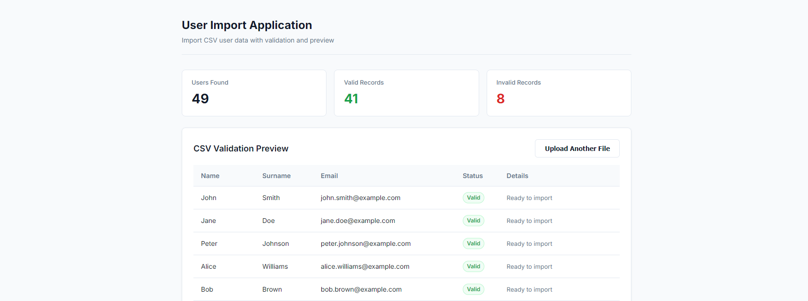

# A Simple User Import PHP App

A full-stack CSV user import application built with PHP and React. This appparses CSV user files, validates input records, auto-formats names to title case and emails to lowercase, and imports valid user records into PostgreSQL.

It provides both a PHP Command Line Interface (CLI) tool and a RESTful web API paired with a modern React interface.

<!--  -->



## Table of Contents

## How to run

### Prerequisites

- **Docker Setup**: Docker Engine & Docker Compose
- **Manual Setup**: PHP 8.1+ (with `pdo_pgsql` extension enabled), Composer, Node.js 18+, and PostgreSQL 16

### 1. Docker (Recommended)

Start frontend, backend, and PostgreSQL containers:

```bash
docker compose up --build -d
```

Access the web UI at `http://localhost:3000` or backend API at `http://localhost:8080` in the deployed docker container.

Running the CLI tool inside the backend container:

```bash
# Rebuild users table
docker exec -it user_import_backend php user_upload.php --create-table

# Dry run mode (parse & validate without inserting to database)
docker exec -it user_import_backend php user_upload.php --file users.csv --dry-run

# Normal import
docker exec -it user_import_backend php user_upload.php --file users.csv
```

### 2. Manual Setup (Native PHP & Node)

Ensure a PostgreSQL instance is running locally and configure environment variables in `.env` (copy from `.env.example`):

```bash
cp .env.example .env
```

Install backend dependencies and initialize the PostgreSQL database schema:

```bash
composer install

# Rebuild PostgreSQL users table and index
php user_upload.php --create-table
```

Execute CLI commands or start local web API server:

```bash
# Dry run mode (validate without saving)
php user_upload.php --file users.csv --dry-run

# Normal import
php user_upload.php --file users.csv

# Optional: serve backend REST API locally for web frontend
php -S localhost:8080 bin/user_upload.php
```

Install frontend dependencies and start Vite dev server:

```bash
npm --prefix frontend install
npm --prefix frontend run dev
```

## Methods

### Endpoints

| Method | Endpoint            | Description                                                 | Content-Type / Payload                                               |
| ------ | ------------------- | ----------------------------------------------------------- | -------------------------------------------------------------------- |
| `POST` | `/api/preview`      | Preview CSV validation results without saving (Dry Run)     | `multipart/form-data` (`file`) or `application/json` (`csv_content`) |
| `POST` | `/api/import`       | Validate and import valid CSV user records into PostgreSQL  | `multipart/form-data` (`file`) or `application/json` (`csv_content`) |
| `POST` | `/api/create-table` | Initialize or drop and rebuild the `users` PostgreSQL table | N/A                                                                  |
| `GET`  | `/api/users`        | Fetch all imported user records stored in PostgreSQL        | N/A                                                                  |

### CLI args

| Option              | Type     | Description                                                           |
| ------------------- | -------- | --------------------------------------------------------------------- |
| `--file <filename>` | Required | Name or path of the CSV file to process                               |
| `--dry-run`         | Flag     | Runs parsing and validation without inserting records into PostgreSQL |
| `--create-table`    | Flag     | Rebuilds the PostgreSQL `users` table and unique email index          |
| `--help`            | Flag     | Displays available CLI options and usage instructions                 |

## Architecture Decisions and Tech Stack

## Validation Matrix

Essentially, this is my own methodology to distinguish and separate validation places, since in big applications, validation can happen in both frontend and backend, and tracking and managing code can be difficult.

This matrix helps us developer understand in what part validation should live inside the code, this way we never have to be confused again why there is some obscure check in some random react arrow function in the frontend.

<table style="width: 100%; border-collapse: collapse; border: 1px solid #30363d;">
  <thead>
    <tr style="border-bottom: 1px solid #30363d;">
      <td align="left" style="padding: 10px; font-weight: bold; border-right: 1px solid #30363d; border-bottom: 1px solid #30363d;">Rule</td>
      <td align="center" style="padding: 10px; font-weight: bold; border-right: 1px solid #30363d; border-bottom: 1px solid #30363d;">React Comp</td>
      <td align="center" style="padding: 10px; font-weight: bold; border-right: 1px solid #30363d; border-bottom: 1px solid #30363d;">React API</td>
      <td align="center" style="padding: 10px; font-weight: bold; border-right: 1px solid #30363d; border-bottom: 1px solid #30363d;">Backend</td>
      <td align="left" style="padding: 10px; font-weight: bold; border-bottom: 1px solid #30363d;">Requirement</td>
    </tr>
  </thead>
  <tbody>
    <tr style="border-bottom: 1px solid #30363d;">
      <td style="padding: 10px; border-right: 1px solid #30363d; border-bottom: 1px solid #30363d;"><b>CSV Extension</b></td>
      <td align="center" style="padding: 10px; border-right: 1px solid #30363d; border-bottom: 1px solid #30363d;">✓</td>
      <td align="center" style="padding: 10px; border-right: 1px solid #30363d; border-bottom: 1px solid #30363d;">-</td>
      <td align="center" style="padding: 10px; border-right: 1px solid #30363d; border-bottom: 1px solid #30363d;">✓</td>
      <td style="padding: 10px; border-bottom: 1px solid #30363d;">Must be CSV</td>
    </tr>
    <tr style="border-bottom: 1px solid #30363d;">
      <td style="padding: 10px; border-right: 1px solid #30363d; border-bottom: 1px solid #30363d;"><b>File Size</b></td>
      <td align="center" style="padding: 10px; border-right: 1px solid #30363d; border-bottom: 1px solid #30363d;">✓</td>
      <td align="center" style="padding: 10px; border-right: 1px solid #30363d; border-bottom: 1px solid #30363d;">-</td>
      <td align="center" style="padding: 10px; border-right: 1px solid #30363d; border-bottom: 1px solid #30363d;">✓</td>
      <td style="padding: 10px; border-bottom: 1px solid #30363d;">Max 50 MB</td>
    </tr>
    <tr style="border-bottom: 1px solid #30363d;">
      <td style="padding: 10px; border-right: 1px solid #30363d; border-bottom: 1px solid #30363d;"><b>CSV Parsing</b></td>
      <td align="center" style="padding: 10px; border-right: 1px solid #30363d; border-bottom: 1px solid #30363d;">-</td>
      <td align="center" style="padding: 10px; border-right: 1px solid #30363d; border-bottom: 1px solid #30363d;">-</td>
      <td align="center" style="padding: 10px; border-right: 1px solid #30363d; border-bottom: 1px solid #30363d;">✓</td>
      <td style="padding: 10px; border-bottom: 1px solid #30363d;">Valid CSV</td>
    </tr>
    <tr style="border-bottom: 1px solid #30363d;">
      <td style="padding: 10px; border-right: 1px solid #30363d; border-bottom: 1px solid #30363d;"><b>Required Columns</b></td>
      <td align="center" style="padding: 10px; border-right: 1px solid #30363d; border-bottom: 1px solid #30363d;">-</td>
      <td align="center" style="padding: 10px; border-right: 1px solid #30363d; border-bottom: 1px solid #30363d;">-</td>
      <td align="center" style="padding: 10px; border-right: 1px solid #30363d; border-bottom: 1px solid #30363d;">✓</td>
      <td style="padding: 10px; border-bottom: 1px solid #30363d;">Name, Surname, Email</td>
    </tr>
    <tr style="border-bottom: 1px solid #30363d;">
      <td style="padding: 10px; border-right: 1px solid #30363d; border-bottom: 1px solid #30363d;"><b>Email Format</b></td>
      <td align="center" style="padding: 10px; border-right: 1px solid #30363d; border-bottom: 1px solid #30363d;">-</td>
      <td align="center" style="padding: 10px; border-right: 1px solid #30363d; border-bottom: 1px solid #30363d;">-</td>
      <td align="center" style="padding: 10px; border-right: 1px solid #30363d; border-bottom: 1px solid #30363d;">✓</td>
      <td style="padding: 10px; border-bottom: 1px solid #30363d;">Valid email</td>
    </tr>
    <tr style="border-bottom: 1px solid #30363d;">
      <td style="padding: 10px; border-right: 1px solid #30363d; border-bottom: 1px solid #30363d;"><b>Email Uniqueness</b></td>
      <td align="center" style="padding: 10px; border-right: 1px solid #30363d; border-bottom: 1px solid #30363d;">-</td>
      <td align="center" style="padding: 10px; border-right: 1px solid #30363d; border-bottom: 1px solid #30363d;">-</td>
      <td align="center" style="padding: 10px; border-right: 1px solid #30363d; border-bottom: 1px solid #30363d;">✓</td>
      <td style="padding: 10px; border-bottom: 1px solid #30363d;">Must be unique</td>
    </tr>
  </tbody>
</table>

<br>
This example uses very simple responsibilities, you can arguably add more stuff the bigger the application gets and modify the matrix to separate by API calls or features.
